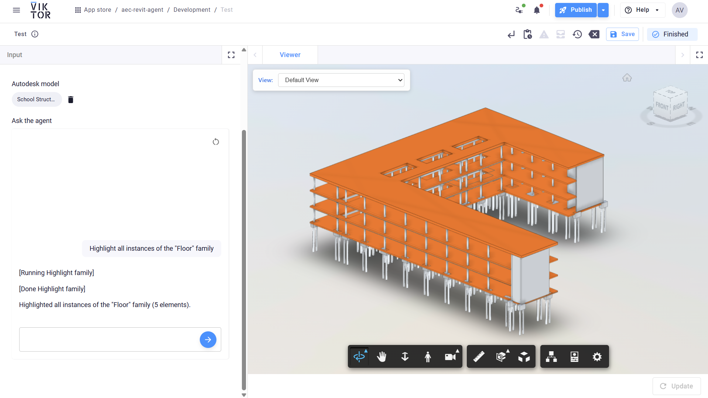

# AEC Data Model Agent

Chat with your Autodesk Revit models using simple language, powered by the AEC Data Model API, VIKTOR, and OpenAI.





## Example Prompts

```
Highlight all the instances of the Floor family
Highlight the instances from the family Basic Wall and type "CL_W1"
Show me the element group id
Clear highlights
```

## Setup

### viktor.config.toml

Set up your Autodesk integration following the [VIKTOR ACC guide](https://docs.viktor.ai/docs/create-apps/software-integrations/autodesk-construction-cloud/#working-with-acc-in-viktor-apps).

Remember to:
- Set `app_type = "simple"`
- Change the application name in the config

### API Keys

- For local development, put your OpenAI API key in a `.env` file. Never share this file.
- For production, use VIKTOR's environment variables to store your keys safely. See the [VIKTOR docs](https://docs.viktor.ai/docs/create-apps/development-tools-and-tips/environment-variables/) for details.

## Useful Links

- [OpenAI Agents Python](https://openai.github.io/openai-agents-python/)
- [VIKTOR LLM Chat](https://docs.viktor.ai/docs/create-apps/user-input/llm-chat/)
- [AEC Data Model GraphQL API](https://aps.autodesk.com/en/docs/aec/v1/developers_guide/overview/)
- [VIKTOR + Autodesk Integration](https://docs.viktor.ai/docs/create-apps/software-integrations/autodesk-platform-services/)
