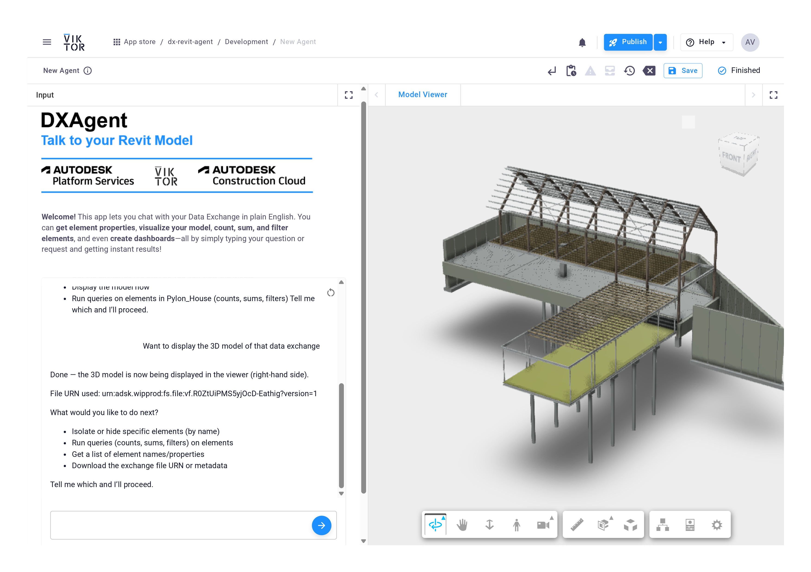
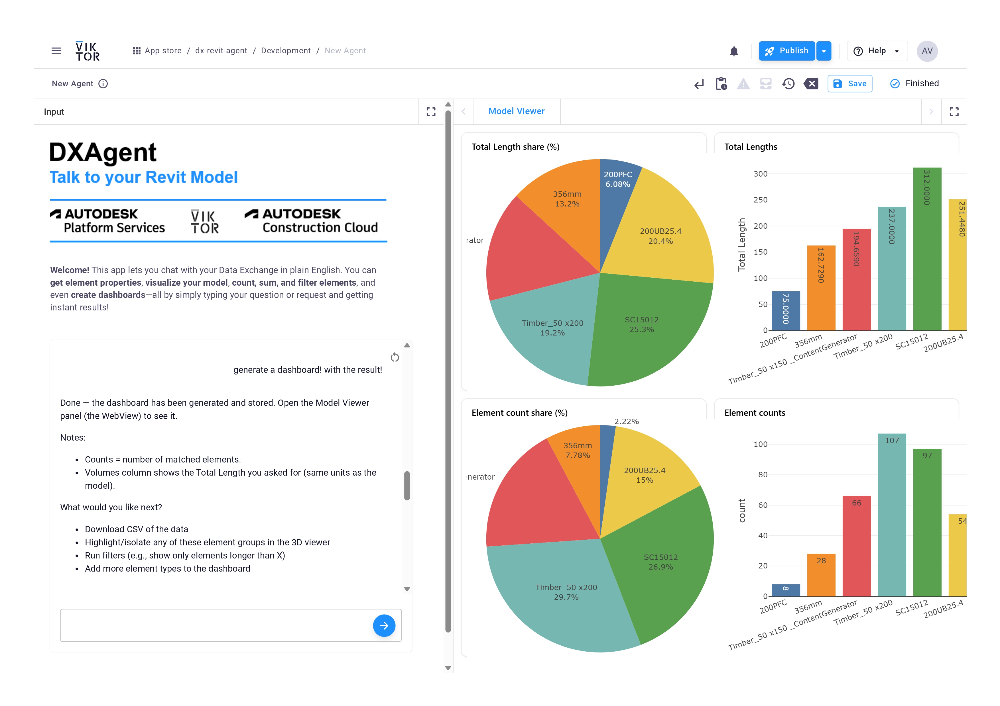

# DX Agent – Talk to Your Revit Model

This app lets you chat with your Autodesk Revit models using simple language, powered by the Data Exchange API, VIKTOR, and OpenAI. You can ask questions, get data, and see dashboards or 3D models from your projects.





## What Can You Do?

- List all your Autodesk Construction Cloud (ACC) hubs
- List all Data Exchanges in a hub
- Show a 3D model from a Data Exchange
- Highlight elements in the model (for example, “200PFC”)
- Get total length and count for elements (for example, “200PFC”, “356mm”, “Timber_50 x 200”)
- Create dashboards with charts for your model data


You can use simple commands like:

```
List all my hubs!
List all my data exchanges in the first hub.
Show the 3D model of my Pylon House data exchange.
Highlight "200PFC".
For each of these elements: "200PFC", "356mm", "Timber_50 x 200", calculate total length and number of elements.
Make a dashboard for these elements.
```



## How Does It Work?

- The app connects to Autodesk Data Exchange using the GraphQL API.
- It uses VIKTOR to build the web interface and connect to your ACC account.
- The AI agent (see `app/agent.py`) understands your questions and uses special tools to get data, show models, or make dashboards.
- The app uses OpenAI for language understanding.

## API Keys and Security

- For local development, put your OpenAI API key in a `.env` file. Never share this file.
- For production, use VIKTOR’s environment variables to store your keys safely. See the [VIKTOR docs](https://docs.viktor.ai/docs/create-apps/development-tools-and-tips/environment-variables/) for details.

## More Info

- Main logic: `app/agent.py`
- Tools for data and models: `app/tools/`
- 3D and dashboard views: `app/views/`
- Images: `app/assets/`

## Useful Links

- [OpenAI Agents Python](https://openai.github.io/openai-agents-python/)
- [VIKTOR LLM Chat](https://docs.viktor.ai/docs/create-apps/user-input/llm-chat/)
- [Autodesk Data Exchange GraphQL API](https://aps.autodesk.com/en/docs/fdxgraph/v1/developers_guide/overview/)
- [VIKTOR + Autodesk Integration](https://docs.viktor.ai/docs/create-apps/software-integrations/autodesk-platform-services/)

---

Let us know if you want to add more examples or details!
